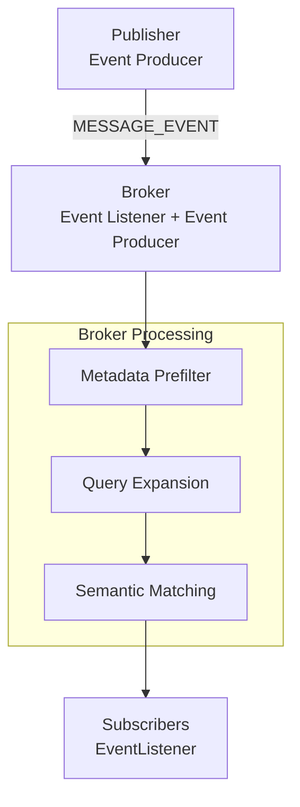

# Basically Publish-Subscribe + Query Expansion
Uses [DSOL](https://simulation.tudelft.nl/dsol/docs/latest/documentation.html) as base event-driven simulation. 
Planning to use [TREC-Microblog datasets](https://github.com/ngc7023/TREC-Microblog-Datasets/tree/master) for the event messages. Will be updating this.

